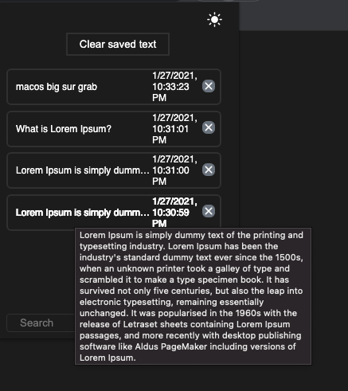

# Clipboard history Chrome extension

Extension to save history of copied text in chrome browser.

it saves each item copied on the clipboard allowing access to any of those items any time later.

Link to extension in chrome store: [Clipboard History](https://chrome.google.com/webstore/detail/clipboard-history/mhokbaagmjlbflncohdhinppihlojpco?hl=en&authuser=0)
## Getting started
1. Turn on developer mode on chrome extensions page
2. Click Load unpacked, and then load the directory of the project
3. After Copying text, you will see it in the extension popup

## How to use

* Clicking on one item will copy the text to clipboard

* Searching for text will search all the items for matching text

* Hovering over one item will show all the text content in the toolip

* Clicking on clear saved text will clear all the saved text

## Images

    
    

    

    

    

    

## Isn't working as expected?

Please create [an issue](https://github.com/saifabusaleh/clipboard-history-extension/issues/new)
