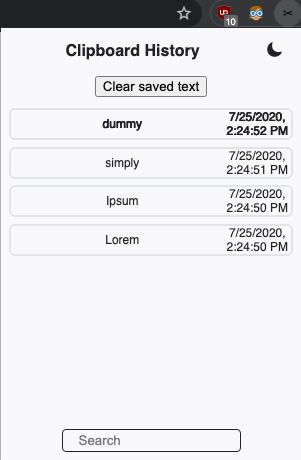
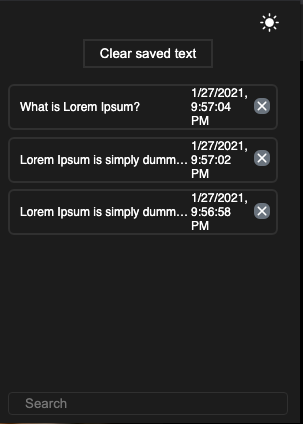
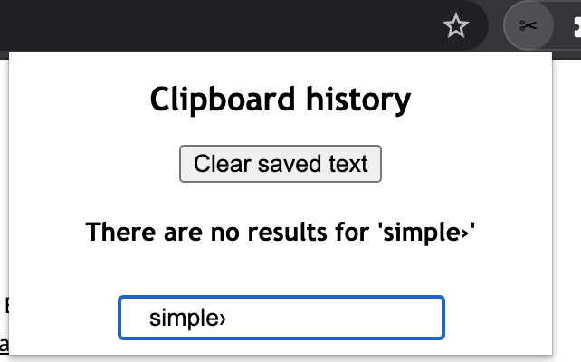
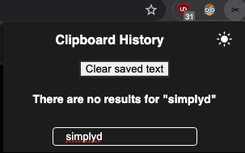

# Text Saver Chrome extension

Extension to save history of copied text in browser.

## Getting started
1. Turn on developer mode on chrome extensions page
2. Click Load unpacked, and then load the directory of the project
3. After Copying text, you will see it in the extension popup

## How to use

* Clicking on clear saved text will clear all the saved text

* Hovering on one item will show all the text content in the toolip

* Clicking on one item will copy the text to clipboard

* Searching for text will search all the items for matching text

## Images

    

    

    

    

